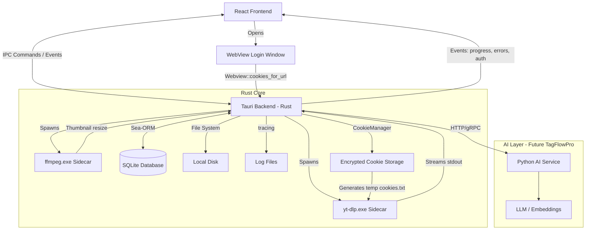
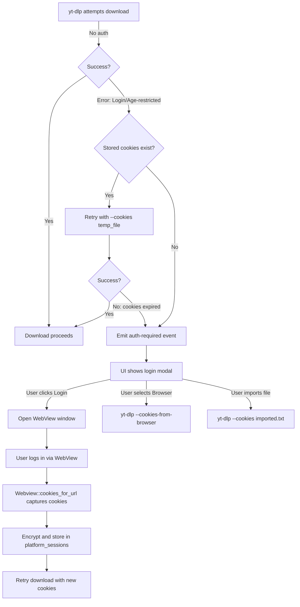

# Technical Architecture

## 1. High-Level Stack
-   **Frontend (UI):** React (Vite) + TailwindCSS + TypeScript.
-   **Backend:** Tauri v2 (Rust).
-   **Download Engine:** `yt-dlp` (standalone binary) as a Sidecar.
-   **Media Processing:** `ffmpeg` (standalone binary) as a Sidecar.
-   **Database:** SQLite (managed via Sea-ORM).
-   **State Management:** TanStack Query (React Query) + Zustand.
-   **Internationalization:** react-i18next + i18next.
-   **Logging:** `tracing` (Rust) + custom frontend logger via IPC.

## 2. Architecture Diagram



## 3. Communication Flow

### Download Process
1.  **User Action:** User pastes a URL in React UI and clicks "Download".
2.  **Frontend:** Calls `invoke('create_download_task', { url })`.
3.  **Rust:**
    -   Creates a record in `download_tasks` table (Status: `QUEUED`).
    -   Queue scheduler picks up the task when a worker slot is available.
4.  **Rust (Worker):**
    -   Updates status to `FETCHING_META`.
    -   Executes `yt-dlp --dump-json {url}`.
    -   Parses JSON response (identifies Creator, Title, Media items, estimated size).
    -   Updates status to `READY` and creates/links `posts` record.
5.  **Rust (Auto-start or user confirm):**
    -   Updates status to `DOWNLOADING`.
    -   Spawns `yt-dlp` with download flags + `--write-thumbnail --convert-thumbnails jpg`.
    -   **Stream Listener:** Reads `stdout` lines to parse `[download]` progress (%).
    -   **Event Emit:** Emits `download-progress` event to Frontend via Tauri events.
6.  **Rust (Completion):**
    -   Updates `download_tasks.status` to `COMPLETED`.
    -   Updates `posts.status` to `COMPLETED` and creates `media` entries.
    -   Spawns `ffmpeg` to generate reduced thumbnail (300px) for Wall performance.

### Wall View
1.  **Frontend:** Calls `invoke('get_posts', { page, limit, filters })`.
2.  **Rust:** Queries SQLite with pagination via Sea-ORM.
3.  **Rust:** Returns JSON array of Post objects (each containing `media` array).
4.  **Frontend:** Renders virtualized Masonry Grid. Thumbnails served via `convertFileSrc`.

### Cookie / Auth Flow



1.  **L0 — Default:** No auth flags sent to `yt-dlp`.
2.  **On restricted content error:** CookieManager checks `platform_sessions` for stored cookies.
3.  **If cookies exist:** Generates temp `cookies.txt`, retries with `--cookies temp_file.txt`. Temp file deleted after use.
4.  **If cookies expired/missing:** Emits `auth-required` event. Frontend shows login modal.
5.  **WebView Login (L1):** Opens a secondary WebView window with the platform login page. After login, captures cookies via `Webview::cookies_for_url()`, encrypts, and stores in `platform_sessions`.
6.  **Browser Extraction (L2):** Fallback — uses `--cookies-from-browser {browser}`. Requires browser to be closed.
7.  **Manual Import (L3):** User imports a `cookies.txt` file via file picker.
8.  **Settings:** User configures preferred cookie method and default browser in Settings > Accounts.

## 4. File Structure Strategy

We prioritize a **User-First "Clean" Structure**. The user's download folder should contain *only* the media content they requested, organized logically. Metadata, cache, and raw thumbnails are stored internally.

### 4.1. Directory Layout

```text
/app_data/                          (Tauri app_data_dir - Internal)
  /library/                         (Internal Media Metadata)
    /thumbs/
      /YouTube/
        VideoID_original.jpg
        VideoID_300w.jpg
    /avatars/
      CreatorID.jpg

  /system/                          (App Infrastructure)
    /utils/
      yt-dlp.exe
      ffmpeg.exe
    /database/
      video_downloader_pro.db
    /auth/
      youtube.cookies.enc
    /temp/
      (transient cookie files)
    /logs/
      app.log
      
/downloads/                         (User-Configurable Path)
  /YouTube/
    /My Chill Playlist/             (Source: Playlist Name)
      20240101_LoFi_Beats_[ID].mp4
      20240102_Jazz_Vibes_[ID].mp4
    /MKBHD/                         (Source: Channel OR Direct Download)
      20240215_Vision_Pro_Review_[ID].mp4
  /Instagram/
    /Saved_Collection/              (Source: Saved Posts)
      Image1_[ID].jpg
```

### 4.2. Logic: "Smart Context" Grouping

Files are grouped based on the **User's Intent** (how they initiated the download):

1.  **Source-Based (Playlist/Collection):**
    -   If the download comes from a tracked `Source` (e.g., a YouTube Playlist, an Instagram Collection), the folder name is the **Source Name**.
    -   *Example:* Downloading the "Gym Music" playlist -> `/downloads/YouTube/Gym Music/`.

2.  **Creator-Based (Channel/Direct):**
    -   If the download is a direct URL or from a `Source` of type `CHANNEL`, the folder name is the **Creator Name**.
    -   *Example:* Pasting a specific YouTube URL -> `/downloads/YouTube/CreatorName/`.

3.  **Filename Convention:**
    -   `{Date}_{Title_Sanitized}_[{ID}].{ext}`
    -   Includes ID to ensure uniqueness.
    -   Sanitized to remove illegal characters.

### 4.3. Advantages
-   **No Clutter:** Thumbnails and JSONs don't pollute the user's view.
-   **User-Centric:** Respected the mental model of "Playlists" vs "Channels".
-   **Portable:** Media files are standard and accessible without the app.

## 5. Sidecar Binaries Strategy

### yt-dlp
-   **Bundled** in `src-tauri/binaries/` with target-triple naming at build time.
-   **Runtime copy** to `app_data/binaries/yt-dlp.exe` on first launch.
-   **App always uses** the `app_data` copy (not the bundled one).
-   **Auto-update:** Executes `yt-dlp -U` every 24h (configurable) + manual button in Settings.
-   **On app update:** If bundled version > `app_data` version, replaces it.

### ffmpeg
-   Same pattern as yt-dlp, but updates only with app releases (stable binary).
-   Used for: thumbnail resizing, format conversion, audio extraction merging.

### Permissions
-   Strictly defined in `tauri.conf.json` — only whitelisted commands/paths.
-   Database located in `app_data` directory, never in the executable folder.

## 6. ORM: Sea-ORM
-   **Why:** Async-first, ergonomic API, dynamic query building, native SQLite support.
-   **Version:** Sea-ORM 2.0+ (Rust Edition 2024, RETURNING syntax for SQLite).
-   **Migrations:** Managed via `sea-orm-migration` CLI, stored in `src-tauri/migration/`.

## 7. Logging Strategy

| Component | Tool | Details |
|---|---|---|
| **Rust backend** | `tracing` + `tracing-subscriber` | Structured logging with file rotation |
| **Frontend** | Custom logger → IPC to Rust | Errors and warnings forwarded to backend |
| **yt-dlp output** | `stdout`/`stderr` capture | Full output saved per download task |

-   **Location:** `app_data/logs/`
-   **Rotation:** Daily files, 30-day retention.
-   **Per-download logs:** Saved in `app_data/logs/downloads/task-{uuid}.log`.

## 8. Rate Limiting

| Parameter | Default | Configurable |
|---|---|---|
| Simultaneous downloads | 3 | ✅ (1-10) |
| Delay between downloads | 2s | ✅ |
| Delay between metadata requests | 1s | ✅ |
| Retry on 429 | Exponential backoff | ✅ |
| Max retries | 3 | ✅ |

### yt-dlp flags applied
```bash
--sleep-interval 2
--max-sleep-interval 5
--sleep-requests 1
--retries 3
--fragment-retries 5
--retry-sleep exp:1:30
```

## 9. Future: AI Layer (TagFlowPro)

The AI layer will be a **separate Python service** communicating with Tauri via HTTP/gRPC.

-   **Not part of this module's binary** — independent deployment.
-   **Responsibilities:** Content analysis, tagging, embeddings, recommendations.
-   **Stack:** Python + FastAPI/gRPC + torch + transformers.
-   **Communication:** Tauri Rust backend calls the AI service; results stored in SQLite.
