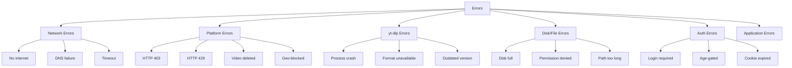

# Error Handling

## Overview
This document catalogs all expected error scenarios, their detection mechanisms, and the recovery strategy for each. Errors are grouped by category.

---

## 1. Error Categories



---

## 2. Error Catalog

### Network Errors

| Code | Error | Detection | Auto-Retry | Recovery |
|---|---|---|---|---|
| `NET_001` | No internet connection | `yt-dlp` exits with network error | ✅ 3x, backoff | Queue pauses. Resume when connectivity restored. |
| `NET_002` | DNS resolution failed | `yt-dlp` stderr contains "Name resolution" | ✅ 2x | Same as above |
| `NET_003` | Connection timeout | `yt-dlp` stderr: "timed out" or process exceeds max time | ✅ 3x, backoff | Retry. If persistent, mark FAILED. |
| `NET_004` | Connection reset / interrupted | `yt-dlp` exit mid-download | ✅ 3x | Use `-c` to resume partial download. |

### Platform Errors

| Code | Error | Detection | Auto-Retry | Recovery |
|---|---|---|---|---|
| `PLAT_001` | HTTP 403 Forbidden | `yt-dlp` stderr: "403" | ❌ | Suggest cookies. See Auth flow. |
| `PLAT_002` | HTTP 429 Rate Limited | `yt-dlp` stderr: "429" or "Too Many Requests" | ✅ Backoff 60s+ | Increase sleep intervals. |
| `PLAT_003` | Video/Post deleted (404) | `yt-dlp` stderr: "not available", "removed", "404" | ❌ | Mark FAILED with reason. |
| `PLAT_004` | Geo-blocked content | `yt-dlp` stderr: "not available in your country" | ❌ | Mark FAILED. Suggest VPN (info only). |
| `PLAT_005` | Private content | `yt-dlp` stderr: "Private video" | ❌ | Mark FAILED. Suggest login/cookies. |
| `PLAT_006` | Live stream (not ended) | `yt-dlp` stderr: "is live" | ❌ | Mark FAILED. Suggest waiting until stream ends. |

### yt-dlp Errors

| Code | Error | Detection | Auto-Retry | Recovery |
|---|---|---|---|---|
| `YT_001` | Process crashed (non-zero exit) | Exit code ≠ 0, no known error pattern | ✅ 1x | Retry once. If repeats, suggest yt-dlp update. |
| `YT_002` | Requested format not available | stderr: "format is not available" | ❌ | Mark FAILED. Show available formats to user. |
| `YT_003` | yt-dlp outdated | stderr: "Unsupported URL" for known platform | ❌ | Prompt to update yt-dlp via Settings. |
| `YT_004` | Merge error (ffmpeg) | stderr: "ffmpeg", "merge" | ✅ 1x | Retry. If repeats, check ffmpeg binary. |

### Disk / File Errors

| Code | Error | Detection | Auto-Retry | Recovery |
|---|---|---|---|---|
| `DISK_001` | Disk full | Pre-check or `yt-dlp` error: "No space left" | ❌ | **Pause entire queue.** Show alert with used/available space. |
| `DISK_002` | Permission denied | File write fails, stderr: "Permission denied" | ❌ | Mark FAILED. Suggest changing download path. |
| `DISK_003` | Path too long (Windows) | File creation fails (> 260 chars) | ❌ | Truncate filename and retry. Log original name. |
| `DISK_004` | File locked | Cannot write/move file | ✅ 1x, 5s delay | Retry after delay. If persistent, FAILED. |

### Auth Errors

| Code | Error | Detection | Auto-Retry | Recovery |
|---|---|---|---|---|
| `AUTH_001` | Login required | stderr: "Sign in", "login required" | ❌ | Emit `auth-required` event. Show login modal with WebView as primary option. |
| `AUTH_002` | Age-gated content | stderr: "age", "Sign in to confirm" | Auto-retry with stored cookies | Retry with stored cookies. If expired/missing, open WebView login. |
| `AUTH_003` | Cookie expired / invalid | Cookies sent but still 403/401 | ❌ | Update `platform_sessions.status` to `EXPIRED`. Show "Refresh session" prompt → reopens WebView login. |
| `AUTH_004` | Browser cookie DB locked | yt-dlp can't read browser cookies | ❌ | Non-critical (browser extraction is fallback). Suggest using WebView login or importing cookies.txt. |
| `AUTH_005` | WebView login failed | WebView blocked (CAPTCHA, bot detection) | ❌ | Fallback to `--cookies-from-browser`. If that fails, prompt cookies.txt import. |

---

## 3. Error Response Strategy

### UI Notifications

| Severity | UI Component | Duration | Examples |
|---|---|---|---|
| **Info** | Toast (bottom-right) | 5 seconds | "yt-dlp updated successfully" |
| **Warning** | Toast (persistent, dismissable) | Until dismissed | "Disk space low: 3.2 GB remaining" |
| **Error** (per-download) | Badge on download task | Persistent | "Format not available" |
| **Critical** | Modal dialog (blocks UI) | Until user acts | "Disk full — queue paused" |

### Error Logging

Every error is logged with:
```
[timestamp] [ERROR] [task_id] [error_code] message
  context: { url, format, retries, exit_code }
  stderr: "full yt-dlp stderr output"
```

- **App log:** `app_data/logs/app-YYYY-MM-DD.log` (Rotated daily)
- **Task context:** structural logs include `task_id` field for filtering.

---

## 4. Retry Strategy

```
delay = min(base_delay * 2^retry_count, max_delay)

Default values:
  base_delay = 30 seconds
  max_delay  = 300 seconds (5 minutes)
  max_retries = 3

Example:
  Retry 1: wait 30s
  Retry 2: wait 60s
  Retry 3: wait 120s
  After retry 3: mark FAILED (no more retries)
```

### Special cases
- **HTTP 429:** `base_delay = 60s`, `max_delay = 600s` (10 min).
- **Network errors:** Standard backoff, but check connectivity first.
- **yt-dlp crash:** Only 1 retry (no backoff), then FAILED + suggest update.

---

## 5. Health Checks

| Check | Frequency | Action on Failure |
|---|---|---|
| `yt-dlp` binary exists | App launch | Download/extract from bundled resources |
| `ffmpeg` binary exists | App launch | Download/extract from bundled resources |
| SQLite DB accessible | App launch | Error modal: "Database corrupted" |
| Download path writable | App launch + before each download | Warning + suggest path change |
| Disk space sufficient | Before each download | Warning if < threshold |
| Internet connectivity | Before each download | Queue pauses, retry when online |
| Cookie session valid | Every 24h + before auth-required download | Update `platform_sessions.status`. Emit `session-status-changed` if expired. |
