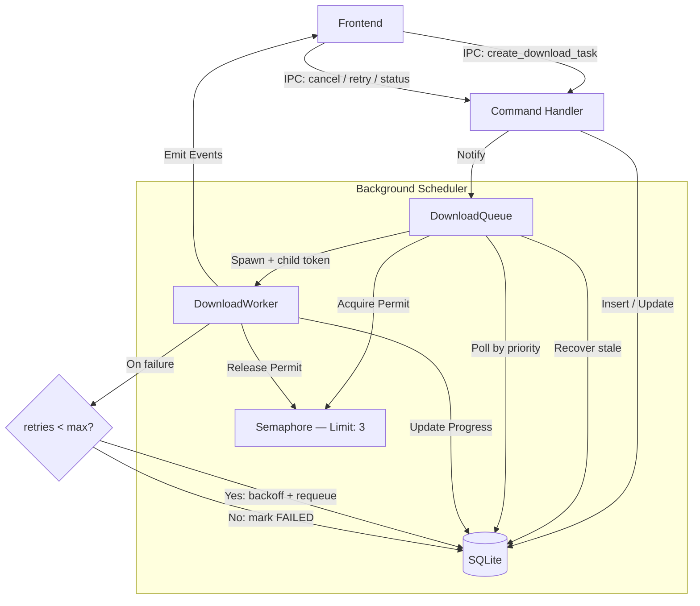

# Queue System

The Download Queue System manages concurrent video downloads to ensure system stability and predictable resource usage. It is built on `tokio` for async execution, `Sea-ORM` for state persistence, and `tokio-util` for cancellation.

## Architecture



## Key Components

### 1. DownloadQueue (`src-tauri/src/queue/manager.rs`)
- **Semaphore**: Limits concurrent downloads (default: 3).
- **Notify**: Async notification mechanism to wake up the scheduler when new tasks are added.
- **CancellationToken**: Parent token enables graceful shutdown; child tokens enable per-task cancellation.
- **Task Token Registry**: `HashMap<String, CancellationToken>` tracks active tasks for targeted cancellation.
- **Stale Recovery**: On startup, resets any `PROCESSING` tasks back to `QUEUED`.
- **Scheduler Loop**: Checks DB before acquiring a permit; waits for notification when queue is empty.

### 2. DownloadWorker (`src-tauri/src/download/worker.rs`)
- **Cancellation**: Uses `tokio::select!` to race stdout reading against `CancellationToken`.
- **Stderr capture**: Separate tokio task collects stderr lines for error reporting.
- **Format selection**: Passes `-f <format>` when `format_selection` is provided.
- **Output template**: Uses `--output "%(title)s.%(ext)s"`.
- **Progress throttling**: Emits events at most every 500ms to avoid IPC flooding.
- **DB writes**: Persists `progress`, `speed`, `eta` using `update_many` to avoid redundant `SELECT` queries.

### 3. Task States (`download_task` table)
- `QUEUED`: Waiting for a slot.
- `PROCESSING`: Currently downloading.
- `COMPLETED`: Finished successfully.
- `FAILED`: Permanently failed (retries exhausted).
- `CANCELLED`: Cancelled by user.
- `PAUSED`: Paused by user (individual or via global pause).

### 4. Retry Logic
- On failure, checks `retries < max_retries` (default: 3).
- Increments `retries`, resets to `QUEUED`, applies exponential backoff (5s × 2^n).
- After all retries exhausted, marks `FAILED` with error message from stderr.

### 5. Pause / Resume
- **Global pause**: `AtomicBool` flag checked by the scheduler — stops picking up new tasks.
- **Per-task pause**: PROCESSING tasks are cancelled (yt-dlp killed) and marked `PAUSED`. QUEUED tasks are set directly to `PAUSED`.
- **Resume**: PAUSED tasks are set back to `QUEUED`. yt-dlp `-c` flag enables native partial download resumption.

### 6. IPC Commands
| Command | Description |
|---------|-------------|
| `create_download_task` | Creates a DB entry with `QUEUED` status and notifies the scheduler. |
| `cancel_download_task` | Cancels a running task (kills yt-dlp) or marks a queued task as `CANCELLED`. |
| `retry_download_task` | Resets a `FAILED` or `CANCELLED` task to `QUEUED` with retries cleared. |
| `get_queue_status` | Returns all tasks + global `is_paused` flag. |
| `pause_download_task` | Pauses a single QUEUED or PROCESSING task. |
| `resume_download_task` | Resumes a PAUSED task back to QUEUED. |
| `pause_queue` | Globally pauses the scheduler. |
| `resume_queue` | Resumes the scheduler. |

## Usage

The queue is initialized in `lib.rs` and managed as Tauri state.

```rust
// In lib.rs
let queue = queue::DownloadQueue::new(app.handle().clone(), 3);
app.manage(queue.clone());
tauri::async_runtime::spawn(async move {
    queue.start_scheduler().await;
});
```
