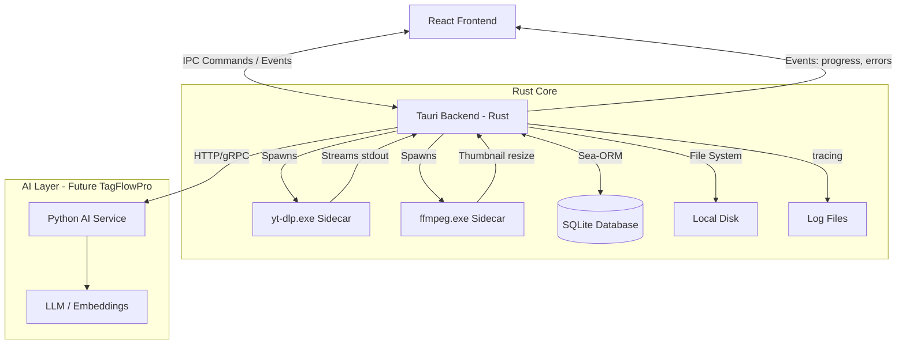

# Technical Architecture

## 1. High-Level Stack
-   **Frontend (UI):** React (Vite) + TailwindCSS + TypeScript.
-   **Backend:** Tauri v2 (Rust).
-   **Download Engine:** `yt-dlp` (standalone binary) as a Sidecar.
-   **Media Processing:** `ffmpeg` (standalone binary) as a Sidecar.
-   **Database:** SQLite (managed via Sea-ORM).
-   **State Management:** TanStack Query (React Query) + Zustand.
-   **Internationalization:** react-i18next + i18next.
-   **Logging:** `tracing` (Rust) + custom frontend logger via IPC.

## 2. Architecture Diagram



## 3. Communication Flow

### Download Process
1.  **User Action:** User pastes a URL in React UI and clicks "Download".
2.  **Frontend:** Calls `invoke('create_download_task', { url })`.
3.  **Rust:**
    -   Creates a record in `download_tasks` table (Status: `QUEUED`).
    -   Queue scheduler picks up the task when a worker slot is available.
4.  **Rust (Worker):**
    -   Updates status to `FETCHING_META`.
    -   Executes `yt-dlp --dump-json {url}`.
    -   Parses JSON response (identifies Creator, Title, Media items, estimated size).
    -   Updates status to `READY` and creates/links `posts` record.
5.  **Rust (Auto-start or user confirm):**
    -   Updates status to `DOWNLOADING`.
    -   Spawns `yt-dlp` with download flags + `--write-thumbnail --convert-thumbnails jpg`.
    -   **Stream Listener:** Reads `stdout` lines to parse `[download]` progress (%).
    -   **Event Emit:** Emits `download-progress` event to Frontend via Tauri events.
6.  **Rust (Completion):**
    -   Updates `download_tasks.status` to `COMPLETED`.
    -   Updates `posts.status` to `COMPLETED` and creates `media` entries.
    -   Spawns `ffmpeg` to generate reduced thumbnail (300px) for Wall performance.

### Wall View
1.  **Frontend:** Calls `invoke('get_posts', { page, limit, filters })`.
2.  **Rust:** Queries SQLite with pagination via Sea-ORM.
3.  **Rust:** Returns JSON array of Post objects (each containing `media` array).
4.  **Frontend:** Renders virtualized Masonry Grid. Thumbnails served via `convertFileSrc`.

### Cookie / Auth Flow
1.  **Default:** No auth flags sent to `yt-dlp`.
2.  **On restricted content error:** Rust retries with `--cookies-from-browser {configured_browser}`.
3.  **On browser DB locked error:** UI prompts user to export `cookies.txt` manually.
4.  **Settings:** User can set default browser and always-use-cookies preference.

## 4. File Structure Strategy
```
/app_data/                          (Tauri app_data_dir)
  /binaries/
    yt-dlp.exe                      (auto-updatable copy)
    ffmpeg.exe
  /database/
    video_downloader_pro.db         (SQLite)
  /logs/
    app-2026-02-16.log              (daily rotation, 30 day retention)
    /downloads/
      task-{uuid}.log              (per-download debug log)
  /trash/                           (soft-deleted files pending cleanup)

/downloads/                         (user-configurable path)
  /YouTube/
    /CreatorName/
      /PostTitle-ID/
        Video.mp4
        Video.mp4.thumbnail.jpg     (original from yt-dlp)
        Video.mp4.thumb_sm.jpg      (300px reduced for Wall)
  /Instagram/
    /CreatorName/
      /PostTitle-ID/
        Image1.jpg
        Image2.jpg
        Video.mp4
```

## 5. Sidecar Binaries Strategy

### yt-dlp
-   **Bundled** in `src-tauri/binaries/` with target-triple naming at build time.
-   **Runtime copy** to `app_data/binaries/yt-dlp.exe` on first launch.
-   **App always uses** the `app_data` copy (not the bundled one).
-   **Auto-update:** Executes `yt-dlp -U` every 24h (configurable) + manual button in Settings.
-   **On app update:** If bundled version > `app_data` version, replaces it.

### ffmpeg
-   Same pattern as yt-dlp, but updates only with app releases (stable binary).
-   Used for: thumbnail resizing, format conversion, audio extraction merging.

### Permissions
-   Strictly defined in `tauri.conf.json` — only whitelisted commands/paths.
-   Database located in `app_data` directory, never in the executable folder.

## 6. ORM: Sea-ORM
-   **Why:** Async-first, ergonomic API, dynamic query building, native SQLite support.
-   **Version:** Sea-ORM 2.0+ (Rust Edition 2024, RETURNING syntax for SQLite).
-   **Migrations:** Managed via `sea-orm-migration` CLI, stored in `src-tauri/migration/`.

## 7. Logging Strategy

| Component | Tool | Details |
|---|---|---|
| **Rust backend** | `tracing` + `tracing-subscriber` | Structured logging with file rotation |
| **Frontend** | Custom logger → IPC to Rust | Errors and warnings forwarded to backend |
| **yt-dlp output** | `stdout`/`stderr` capture | Full output saved per download task |

-   **Location:** `app_data/logs/`
-   **Rotation:** Daily files, 30-day retention.
-   **Per-download logs:** Saved in `app_data/logs/downloads/task-{uuid}.log`.

## 8. Rate Limiting

| Parameter | Default | Configurable |
|---|---|---|
| Simultaneous downloads | 3 | ✅ (1-10) |
| Delay between downloads | 2s | ✅ |
| Delay between metadata requests | 1s | ✅ |
| Retry on 429 | Exponential backoff | ✅ |
| Max retries | 3 | ✅ |

### yt-dlp flags applied
```bash
--sleep-interval 2
--max-sleep-interval 5
--sleep-requests 1
--retries 3
--fragment-retries 5
--retry-sleep exp:1:30
```

## 9. Future: AI Layer (TagFlowPro)

The AI layer will be a **separate Python service** communicating with Tauri via HTTP/gRPC.

-   **Not part of this module's binary** — independent deployment.
-   **Responsibilities:** Content analysis, tagging, embeddings, recommendations.
-   **Stack:** Python + FastAPI/gRPC + torch + transformers.
-   **Communication:** Tauri Rust backend calls the AI service; results stored in SQLite.
