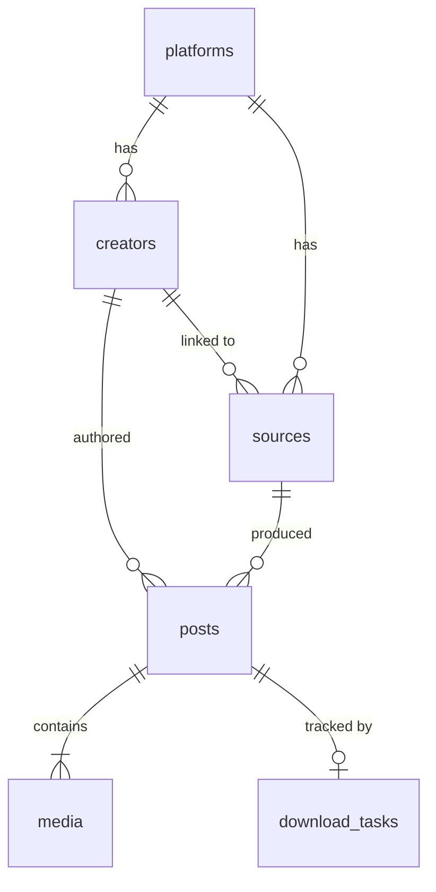

# Database Schema (SQLite) — v3

## Overview
The schema supports a "Wall" based feed system, handling multi-media posts (carousels), configurable sources, a download queue, user settings, and soft-delete (trash). Managed via **Sea-ORM** with `sea-orm-migration`.

---

## Tables

### 1. `platforms`
Defines supported platforms.

| Column | Type | Constraints | Description |
| :--- | :--- | :--- | :--- |
| `id` | TEXT | PRIMARY KEY | e.g., 'youtube', 'tiktok', 'instagram', 'x' |
| `name` | TEXT | NOT NULL | Display name |
| `base_url` | TEXT | NOT NULL | Platform base URL |
| `icon_path` | TEXT | | Path to local icon asset |

### 2. `creators`
Content creators (channels, profiles, accounts).

| Column | Type | Constraints | Description |
| :--- | :--- | :--- | :--- |
| `id` | TEXT | PRIMARY KEY | Unique ID (e.g., YouTube Channel ID) |
| `platform_id` | TEXT | FK → `platforms.id` | |
| `name` | TEXT | NOT NULL | Display name |
| `handle` | TEXT | | e.g., @username |
| `url` | TEXT | NOT NULL | Web URL |
| `avatar_path` | TEXT | | Local path to avatar |
| `created_at` | DATETIME | DEFAULT CURRENT_TIMESTAMP | |

### 3. `sources`
Defines *what* to download and *how*. Can represent a live feed, an archive task, or a specific playlist.

| Column | Type | Constraints | Description |
| :--- | :--- | :--- | :--- |
| `id` | TEXT | PRIMARY KEY | Unique UUID |
| `platform_id` | TEXT | FK → `platforms.id` | |
| `creator_id` | TEXT | FK → `creators.id`, NULLABLE | Optional link to creator |
| `type` | TEXT | NOT NULL | Enum: `CHANNEL`, `PLAYLIST`, `KEYWORD` |
| `name` | TEXT | NOT NULL | Name of the source |
| `url` | TEXT | NOT NULL | Source URL |
| `sync_mode` | TEXT | NOT NULL | Enum: `ALL`, `FROM_NOW`, `DATE_RANGE`, `LATEST_N` |
| `date_start` | DATETIME | | Only download posts after this date |
| `date_end` | DATETIME | | Only download posts before this date |
| `max_items` | INTEGER | | Limit number of items |
| `last_checked` | DATETIME | | Timestamp of last sync |
| `is_active` | BOOLEAN | DEFAULT 1 | Whether to auto-sync |

> **Note:** Source sync modes (`ALL`, `FROM_NOW`, `DATE_RANGE`, `LATEST_N`) are documented but deferred to post-MVP. MVP uses direct URL and playlist downloads only.

### 4. `posts`
Represents a single entry/upload (e.g., a Tweet, an IG Post, a YT Video container).

| Column | Type | Constraints | Description |
| :--- | :--- | :--- | :--- |
| `id` | TEXT | PRIMARY KEY | Platform Post ID |
| `creator_id` | TEXT | FK → `creators.id` | |
| `source_id` | TEXT | FK → `sources.id`, **NULLABLE** | NULL for direct URL downloads |
| `title` | TEXT | | |
| `description` | TEXT | | |
| `original_url` | TEXT | NOT NULL | |
| `status` | TEXT | NOT NULL, DEFAULT `'PENDING'` | Enum: `PENDING`, `COMPLETED`, `FAILED` |
| `posted_at` | DATETIME | | Original upload date |
| `downloaded_at` | DATETIME | | When download completed |
| `deleted_at` | DATETIME | NULLABLE | NULL = active, timestamp = in trash |
| `created_at` | DATETIME | DEFAULT CURRENT_TIMESTAMP | Record creation |

### 5. `media`
Individual media files attached to a post (supports carousels).

| Column | Type | Constraints | Description |
| :--- | :--- | :--- | :--- |
| `id` | TEXT | PRIMARY KEY | Unique UUID |
| `post_id` | TEXT | FK → `posts.id` | |
| `type` | TEXT | NOT NULL | Enum: `VIDEO`, `IMAGE`, `AUDIO` |
| `file_path` | TEXT | NOT NULL | Absolute local path |
| `thumbnail_path` | TEXT | | Original thumbnail (from yt-dlp) |
| `thumbnail_sm_path` | TEXT | | Reduced thumbnail (300px, for Wall) |
| `order_index` | INTEGER | DEFAULT 0 | Position in carousel |
| `width` | INTEGER | | Pixels |
| `height` | INTEGER | | Pixels |
| `duration` | INTEGER | | Seconds (if video/audio) |
| `file_size` | INTEGER | | Bytes |
| `format_id` | TEXT | | yt-dlp format ID |
| `checksum` | TEXT | | SHA-256 hash for duplicate detection |
| `deleted_at` | DATETIME | NULLABLE | NULL = active, timestamp = in trash |

### 6. `download_tasks` *(New)*
Tracks individual download operations in the queue.

| Column | Type | Constraints | Description |
| :--- | :--- | :--- | :--- |
| `id` | TEXT | PRIMARY KEY | Unique UUID |
| `url` | TEXT | NOT NULL | URL to download |
| `post_id` | TEXT | FK → `posts.id`, NULLABLE | Linked after metadata fetch |
| `status` | TEXT | NOT NULL, DEFAULT `'QUEUED'` | Enum: `QUEUED`, `FETCHING_META`, `READY`, `DOWNLOADING`, `PAUSED`, `COMPLETED`, `FAILED`, `CANCELLED` |
| `priority` | INTEGER | DEFAULT 0 | Higher = more urgent. Manual > sync |
| `progress` | REAL | DEFAULT 0.0 | 0.0 to 1.0 |
| `speed` | TEXT | | Current speed (e.g., "2.5 MiB/s") |
| `eta` | TEXT | | Estimated time remaining |
| `error_message` | TEXT | | Last error description |
| `retries` | INTEGER | DEFAULT 0 | Number of retries attempted |
| `max_retries` | INTEGER | DEFAULT 3 | Max allowed retries |
| `format_selection` | TEXT | | User-selected format/quality |
| `created_at` | DATETIME | DEFAULT CURRENT_TIMESTAMP | |
| `started_at` | DATETIME | | When download started |
| `completed_at` | DATETIME | | When download finished |

### 7. `settings` *(New)*
Key-value store for user preferences.

| Column | Type | Constraints | Description |
| :--- | :--- | :--- | :--- |
| `key` | TEXT | PRIMARY KEY | Setting identifier |
| `value` | TEXT | NOT NULL | Setting value (JSON for complex values) |
| `updated_at` | DATETIME | DEFAULT CURRENT_TIMESTAMP | |

**Default settings:**

| Key | Default Value | Description |
|---|---|---|
| `download_path` | `~/Downloads/VideoDownloaderPro` | Default download directory |
| `max_concurrent_downloads` | `3` | Simultaneous downloads (1-10) |
| `preferred_browser` | `chrome` | For cookie extraction |
| `always_use_cookies` | `false` | Send cookies on every request |
| `default_video_format` | `best` | yt-dlp format selection |
| `default_audio_format` | `best` | For audio extraction |
| `trash_auto_clean_days` | `30` | Days before auto-deleting trash |
| `delete_files_on_remove` | `false` | true = permanent delete, false = move to trash |
| `disk_space_warning_gb` | `5` | Alert threshold in GB |
| `ytdlp_auto_update` | `true` | Auto-update yt-dlp |
| `ytdlp_update_interval_hours` | `24` | Hours between update checks |
| `language` | `en` | UI language (en, es) |
| `sleep_interval` | `2` | Seconds between downloads |
| `sleep_requests` | `1` | Seconds between metadata requests |

---

## Relationships

-   **Platform → Creators:** One-to-Many.
-   **Source → Posts:** One-to-Many (nullable — direct downloads have no source).
-   **Creator → Posts:** One-to-Many.
-   **Post → Media:** One-to-Many.
-   **Post → Download Task:** One-to-One (optional).

---

## Cascade & Deletion Rules

| Parent deleted | Child behavior | Files |
|---|---|---|
| **Creator soft-deleted** | Posts are **NOT** cascade-deleted. Creator hidden from UI but data preserved. |
| **Post soft-deleted** | Media entries soft-deleted too. Files moved to `app_data/trash/`. |
| **Post permanently deleted** | Media entries hard-deleted. Files deleted from disk (if configured). |
| **Source deleted** | Posts remain (orphaned). `source_id` set to NULL. |
| **Trash auto-clean** | Posts/media with `deleted_at` older than `trash_auto_clean_days` are permanently removed. |

---

## Indexes

| Name | Columns | Purpose |
|---|---|---|
| `idx_posts_timeline` | `(posted_at DESC)` | Wall feed ordering |
| `idx_posts_status` | `(status)` | Filter by download status |
| `idx_posts_deleted` | `(deleted_at)` | Exclude soft-deleted from queries |
| `idx_media_post` | `(post_id, order_index)` | Carousel items in order |
| `idx_media_checksum` | `(checksum)` | Duplicate detection |
| `idx_download_tasks_status` | `(status, priority DESC)` | Queue scheduling |
| `idx_download_tasks_created` | `(created_at)` | FIFO ordering |

---

## Duplicate Detection

Before creating a new `post`, check:
1. **By `original_url`:** If a post with the same URL exists (including soft-deleted), skip or prompt user.
2. **By `media.checksum`:** After download, compute SHA-256 of each file. If a matching hash exists, warn user of potential duplicate.
