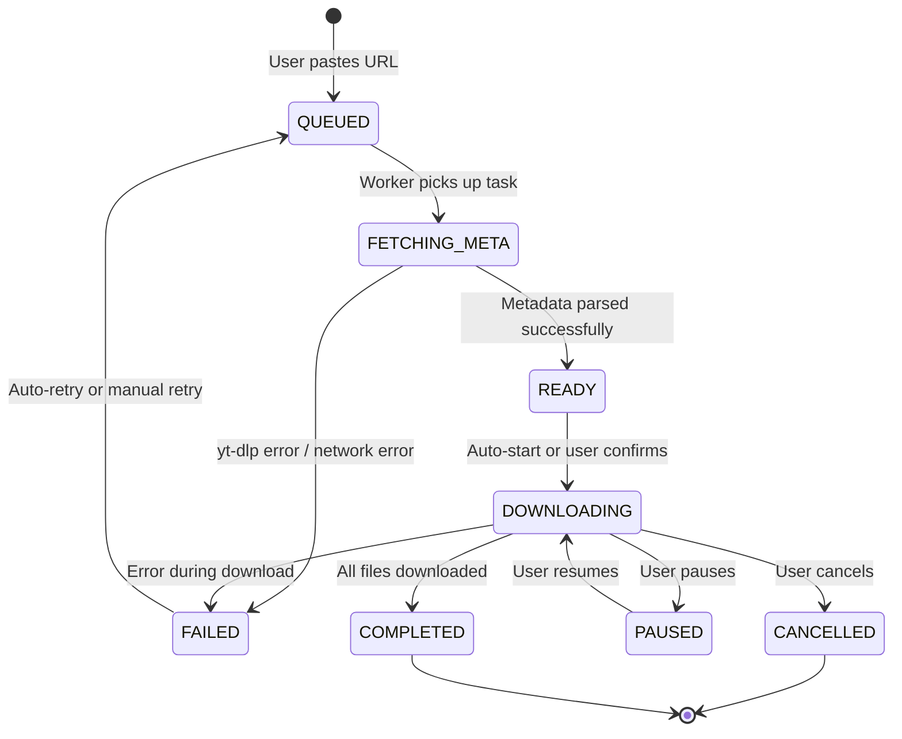
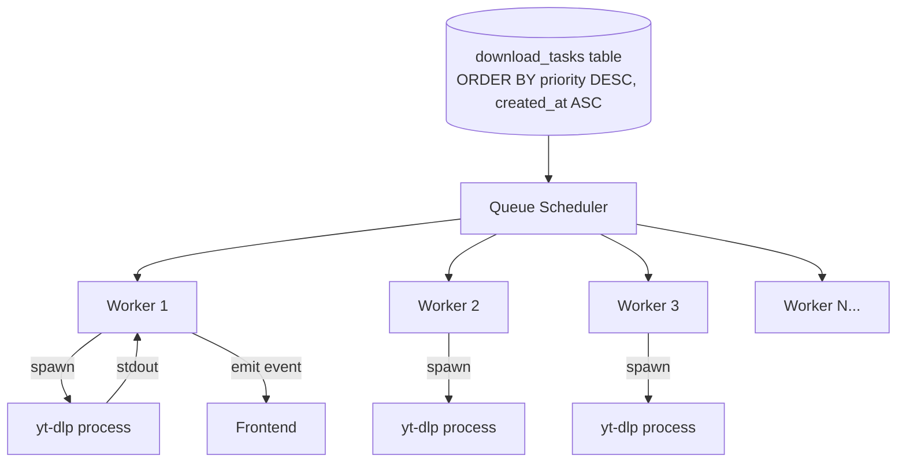

# Download Queue System

## Overview
The download queue is the central mechanism for managing all download operations. It handles concurrency, prioritization, state transitions, retries, and user controls (pause/resume/cancel).

---

## 1. State Machine



### State Descriptions

| State | Description | yt-dlp Process |
|---|---|---|
| `QUEUED` | Waiting in line. No worker assigned yet. | None |
| `FETCHING_META` | Worker is running `yt-dlp --dump-json` to get metadata. | Running (metadata) |
| `READY` | Metadata obtained. Waiting for download to start. | None |
| `DOWNLOADING` | Actively downloading files. Progress events emitting. | Running (download) |
| `PAUSED` | Download halted by user. Partial files preserved. | Killed |
| `COMPLETED` | All files downloaded and post-processed. | None |
| `FAILED` | Error occurred. `error_message` contains details. | Killed/Exited |
| `CANCELLED` | User permanently cancelled. Partial files cleaned up. | Killed |

---

## 2. Worker Pool Architecture



### Scheduling Rules
1. **Pool size:** `max_concurrent_downloads` from `settings` (default: 3, range: 1-10).
2. **Ordering:** `ORDER BY priority DESC, created_at ASC` (highest priority first, then FIFO).
3. **Priority levels:**
   - `10` — Manual single-URL downloads (user-initiated).
   - `5` — Playlist item downloads.
   - `1` — Source sync auto-downloads (post-MVP).
4. **Polling interval:** Scheduler checks for new `QUEUED` tasks every 2 seconds.

---

## 3. Download Flow (Detailed)

### Step 1: Task Creation
```
User pastes URL → Frontend calls invoke('create_download_task', { url, format_selection? })
→ Rust creates download_tasks row (QUEUED) → Returns task_id to frontend
```

### Step 2: Metadata Fetch
```
Worker picks QUEUED task → Sets status FETCHING_META
→ Runs: yt-dlp --dump-json {url} [--cookies-from-browser {browser}]
→ Parses: title, creator, formats, thumbnail_url, duration, file_size_approx
→ Creates/finds creator record → Creates post record (PENDING)
→ Links download_task.post_id → Sets status READY
```

### Step 3: Download
```
Status READY → Auto-transitions to DOWNLOADING (or waits for user confirm)
→ Runs: yt-dlp -f {format} --write-thumbnail --convert-thumbnails jpg -c {url}
→ Streams stdout → Parses [download] X% of Y at Z
→ Updates download_tasks: progress, speed, eta
→ Emits 'download-progress' event to frontend every 500ms
```

### Step 4: Post-Processing
```
yt-dlp exits with code 0 → Status COMPLETED
→ Creates media records (file_path, file_size, dimensions via ffprobe)
→ Computes SHA-256 checksum for each file
→ Generates reduced thumbnail via ffmpeg (-vf scale=300:-1)
→ Updates post.status to COMPLETED, post.downloaded_at = now
→ Checks disk space, emits warning if low
```

---

## 4. User Controls

### Pause
1. Kill the running `yt-dlp` process (SIGTERM/SIGKILL on Windows: `taskkill`).
2. Set `download_tasks.status = 'PAUSED'`.
3. **Partial files are preserved** — yt-dlp creates `.part` files.
4. Worker slot is freed for the next queued task.

### Resume
1. Set `download_tasks.status = 'DOWNLOADING'`.
2. Worker picks up the task.
3. Executes `yt-dlp -c` (continue flag) — resumes from `.part` file.

### Cancel
1. Kill the running `yt-dlp` process.
2. Set `download_tasks.status = 'CANCELLED'`.
3. **Clean up partial files** (delete `.part` files).
4. Optionally remove the `post` record if no completed media exists.

### Retry
1. Triggered automatically (if `retries < max_retries`) or manually by user.
2. Increment `retries` counter.
3. Set status back to `QUEUED`.
4. **If auto-retry:** Apply delay: `backoff = min(30 * 2^retries, 300)` seconds.

---

## 5. Error Handling in Queue

| Error Type | Auto-Retry? | Action |
|---|---|---|
| Network timeout | ✅ Yes | Retry with backoff |
| HTTP 429 (rate limit) | ✅ Yes | Retry with longer backoff (60s+) |
| HTTP 403 (forbidden) | ❌ No | Mark FAILED, suggest cookies |
| Video unavailable (404/deleted) | ❌ No | Mark FAILED, log reason |
| yt-dlp crash | ✅ Yes (1 retry) | Retry once, then FAILED |
| Disk full | ❌ No | Pause entire queue, alert UI |
| Format not available | ❌ No | Mark FAILED, suggest different format |
| Auth required | ❌ No | Mark FAILED, prompt for cookie config |

---

## 6. Frontend Events

| Event Name | Payload | Frequency |
|---|---|---|
| `download-progress` | `{ task_id, progress, speed, eta }` | Every 500ms during download |
| `download-status-changed` | `{ task_id, old_status, new_status, error? }` | On every state transition |
| `queue-updated` | `{ active_count, queued_count, completed_count }` | On any queue change |
| `disk-space-warning` | `{ available_gb, threshold_gb }` | When disk space falls below threshold |

---

## 7. Playlist Handling

When the URL is a playlist:
1. `yt-dlp --dump-json --flat-playlist {url}` extracts all items.
2. One `download_task` is created per playlist item (priority: 5).
3. All tasks share the same `source_id` (if configured).
4. A parent "playlist group" can be tracked via a shared `batch_id` field (optional enhancement).
5. `--download-archive app_data/archives/{source_id}.txt` prevents re-downloading seen items.
