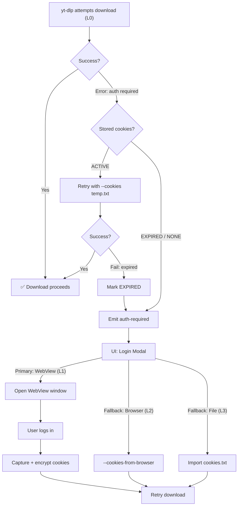
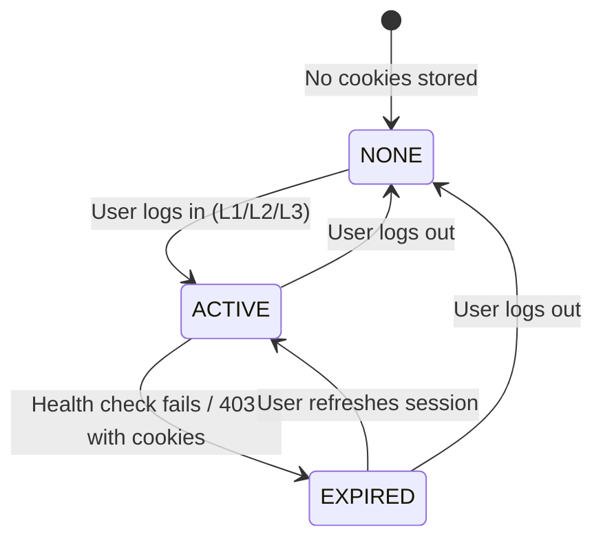

# Cookie & Authentication System

## Overview
VideoDownloaderPro uses a **4-layer progressive authentication strategy** to access restricted content (age-gated, private, login-required). The system minimizes user friction: 90% of downloads require no authentication, and when login is needed, the primary method is a built-in browser (WebView2) — the same UX pattern used by *4K Video Downloader*.

---

## 1. Authentication Layers

| Layer | Method | Friction | Use Case |
|-------|--------|----------|----------|
| **L0** | No auth | None | Public content (default) |
| **L1** | WebView built-in browser | Low | Primary login method. User logs in inside the app |
| **L2** | `--cookies-from-browser` | Medium | Fallback. Reads cookies from installed browser (must be closed) |
| **L3** | `--cookies <file>` import | High | Advanced fallback. Manual `cookies.txt` import |

### Decision Flow

---

## 2. WebView Login Flow (L1)

### How it works
1. App opens a secondary **WebView2 window** with the platform's login URL.
2. User logs in normally (supports 2FA via SMS/email/authenticator).
3. User clicks **"Listo, cerrar"** (or the app detects a successful redirect).
4. Rust backend calls `Webview::cookies_for_url()` (Tauri v2.4.0+) to extract session cookies.
5. Cookies are **encrypted** with Windows DPAPI and stored in `app_data/auth/{platform}.cookies.enc`.
6. `platform_sessions` table is updated with `status = ACTIVE`.
7. If a download was waiting, it automatically retries.

### Platform Login URLs

| Platform | Login URL | Success Indicator |
|----------|-----------|-------------------|
| YouTube | `https://accounts.google.com/ServiceLogin?service=youtube` | Redirect to `youtube.com` |
| Instagram | `https://www.instagram.com/accounts/login/` | Redirect to feed |
| TikTok | `https://www.tiktok.com/login` | Redirect to feed |
| X | `https://x.com/i/flow/login` | Redirect to home |

### WebView Configuration
- **UserAgent:** Matches a standard Chrome browser to avoid bot detection.
- **Window size:** 480×720 (mobile-like for simpler login forms).
- **Isolation:** WebView is sandboxed; cookies don't leak to the main app view.

---

## 3. Cookie Storage & Security

### Encryption
- **Algorithm:** Windows DPAPI (Data Protection API) — OS-level encryption tied to the user account.
- **Storage location:** `app_data/system/auth/{platform_id}.cookies.enc`
- **In-memory only:** Decrypted cookies exist in RAM only during yt-dlp invocation.

### Temporary Cookie Files
When yt-dlp needs cookies:
1. CookieManager decrypts stored cookies → writes a temp `cookies.txt` (Netscape format).
2. File is passed via `yt-dlp --cookies <temp_path>`.
3. File is **deleted immediately** after yt-dlp completes (success or failure).
4. Temp file uses a random UUID filename in `app_data/system/temp/`.

### Database: `platform_sessions`

| Column | Type | Description |
|--------|------|-------------|
| `platform_id` | TEXT PK | One session per platform |
| `status` | TEXT | `ACTIVE`, `EXPIRED`, `NONE` |
| `encrypted_cookies` | BLOB | DPAPI-encrypted cookie data |
| `cookie_method` | TEXT | How cookies were obtained |
| `expires_at` | DATETIME | Estimated expiration |
| `last_verified` | DATETIME | Last successful use |

---

## 4. Cookie Health Monitoring

### Proactive Checks
- **Frequency:** Every 24 hours (configurable).
- **Method:** Lightweight test request to verify session validity.
- **On expiration:** Updates `platform_sessions.status` → `EXPIRED`, emits `session-status-changed` event.

### Reactive Checks
- Before any download that requires auth → verify `last_verified` is recent.
- On `AUTH_003` (cookie invalid) → mark expired, prompt re-login.

### Cookie Lifecycle

---

## 5. Platform-Specific Considerations

| Platform | Cookie Lifetime | Known Issues | Mitigation |
|----------|----------------|--------------|------------|
| **YouTube** | ~30 days | Aggressive cookie rotation in active tabs | Capture from WebView (isolated session, no rotation) |
| **Instagram** | ~90 days | 2FA often required; checkpoint challenges | WebView supports 2FA natively |
| **TikTok** | ~30 days | Frequent CAPTCHA on login | Fallback to `--cookies-from-browser` |
| **X** | ~30 days | OAuth preferred, cookie login less reliable | WebView with standard user agent |

---

## 6. IPC Commands

| Command | Description |
|---------|-------------|
| `open_platform_login` | Opens WebView login for a platform |
| `get_session_status` | Returns session status (one or all platforms) |
| `logout_platform` | Clears cookies for a platform |
| `import_cookies_file` | Imports `cookies.txt` for a platform |
| `set_cookie_method` | Sets preferred auth method globally |

### Events

| Event | Trigger |
|-------|---------|
| `session-status-changed` | Login, logout, or expiration |
| `auth-required` | Download needs auth, no valid cookies |

> Full typed interfaces for all commands and events are documented in [07_ipc_api_contract.md](file:///c:/VideoDownloaderPro/documentation/07_ipc_api_contract.md).

---

## 7. Settings → Accounts UI

The Settings page includes an **Accounts** section showing per-platform session status with login/logout controls. Users can also configure their preferred cookie method (WebView / Browser / File) and select a fallback browser.

> Full UI mockups are available in the [cookie_system_analysis.md](file:///C:/Users/loler/.gemini/antigravity/brain/67857993-11b4-44a3-93a6-03d534cc0a0b/cookie_system_analysis.md) artifact.
