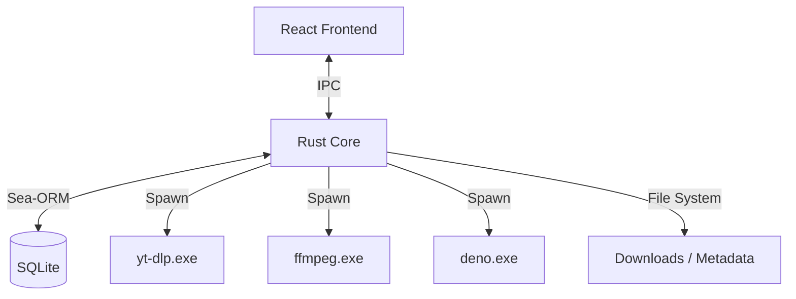

# System Patterns

## Architecture Overview
The application follows a **Tauri v2 (Rust + React)** architecture, leveraging the "Sidecar" pattern for heavy lifting.

## Key Technical Decisions

### 1. IPC Communication
*   **Command/Query Separation:** `invoke()` is used for all state-mutating commands (create task, update settings) and heavy queries.
*   **Events:** `emit()` is used for high-frequency updates (download progress, log streams) to avoid request/response overhead.
*   **Typed Contract:** All IPC payloads are strictly typed in TypeScript and Rust (see `07_ipc_api_contract.md`).

### 6. Git Strategy regarding Sidecars
*   **Binaries Ignored:** `yt-dlp`, `ffmpeg`, and `deno` are added to `.gitignore`.
*   **Download Script:** A PowerShell script (`scripts/download-sidecars.ps1`) is provided to fetch the correct versions for the dev environment.

### 7. Frontend Styling
*   **TailwindCSS v3:** Chosen over v4 for ecosystem stability and better tooling support (IntelliSense).
*   **Design System:** Dark-mode first, using a custom color palette in `tailwind.config.js`.

### 2. Data Persistence
*   **SQLite + Sea-ORM:** Single source of truth for metadata, queue state, and settings.
*   **File System:** Media files are stored in a user-accessible directory (user owns the data). Thumbnails and JSON metadata are stored in `app_data` to keep the user folder clean.

### 3. Authentication (The 4-Layer System)
A progressive strategy to handle platform restrictions (YouTube, Instagram, etc.):
1.  **L0 (None):** Public access.
2.  **L1 (WebView):** Primary. Opens a controlled WebView2 window to capture cookies after user login.
3.  **L2 (Browser):** Fallback. Extracts cookies from installed browsers (Chrome/Edge).
4.  **L3 (File):** Manual `cookies.txt` import.
*   **Security:** Cookies are encrypted via **Windows DPAPI** before storage.

### 4. Download Engine
*   **Queue System:** A background worker pool in Rust manages concurrency (active/queued/paused).
*   **State Machine:** Downloads move through strict states: `QUEUED` -> `FETCHING_META` -> `READY` -> `DOWNLOADING` -> `COMPLETED`.
*   **Recovery:** Resumable downloads using `yt-dlp -c` and partial files.
*   **Process Management (Windows):** Uses `taskkill /F /T /PID` to terminate the entire process tree (including child processes like `ffmpeg`) because standard `Child::kill()` leaves orphans. On non-Windows, falls back to standard kill.
*   **File Size Handling:** For multi-stream downloads (video+audio), `yt-dlp` reports partial stream sizes. The system parses the final merged filename from `[Merger]` output and reads the actual file size from disk upon completion. The total size is updated in the DB to reflect the final file size.
*   **Pause/Resume:** Implemented via `AtomicBool` for global queue pause and cancellation tokens for individual tasks.

### 5. Error Handling
*   **Categorized Errors:** Network, Platform, Disk, Auth, internal.
*   **Graceful Degradation:** The app suggests specific fixes (e.g., "Login required" opens the auth modal) rather than generic "Failed" messages.

## Design Patterns
*   **Sidecar Pattern:** `yt-dlp`, `ffmpeg`, and `deno` are bundled binaries, managed and updated by the app.
*   **Repository Pattern:** Sea-ORM entities abstract the database access.
*   **Observer Pattern:** Frontend subscribes to backend state changes (progress, status).
