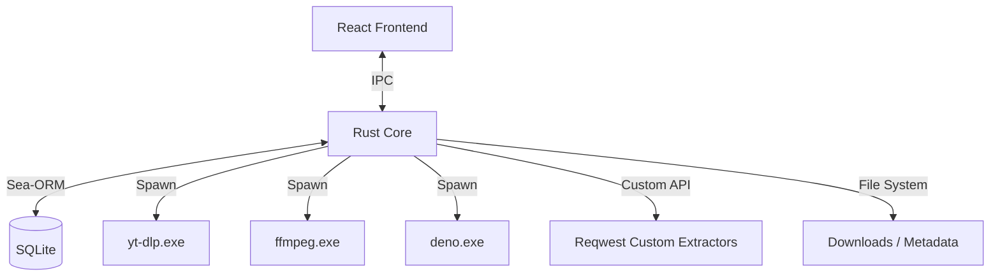

# System Patterns

## Architecture Overview
The application follows a **Tauri v2 (Rust + React)** architecture, leveraging the "Sidecar" pattern for heavy lifting.

```mermaid
graph TD
    UI[React Frontend] <-->|IPC| Core[Rust Core]
    Core <-->|Sea-ORM| DB[(SQLite)]
    Core -->|Spawn| YTDLP[yt-dlp.exe]
    Core -->|Spawn| FFMPEG[ffmpeg.exe]
    Core -->|Spawn| DENO[deno.exe]
    Core -->|Custom API| REQ[Reqwest Custom Extractors]
    Core -->|File System| Storage[Downloads / Metadata]
```

## Key Technical Decisions

### 1. IPC Communication
*   **Command/Query Separation:** `invoke()` is used for all state-mutating commands (create task, update settings) and heavy queries.
*   **Events:** `emit()` is used for high-frequency updates (download progress, log streams) to avoid request/response overhead.
*   **Live-Reload Pattern:** For settings like `concurrent_downloads`, a `tokio::sync::watch` channel is used to propagate changes from the IPC command to background workers without app restart.
*   **Typed Contract:** All IPC payloads are strictly typed in TypeScript and Rust (see `07_ipc_api_contract.md`).

### 6. Git Strategy regarding Sidecars
*   **Binaries Ignored:** `yt-dlp`, `ffmpeg`, and `deno` are added to `.gitignore`.
*   **Download Script:** A PowerShell script (`scripts/download-sidecars.ps1`) is provided to fetch the correct versions for the dev environment.

### 7. Frontend Styling
*   **TailwindCSS v3:** Chosen over v4 for ecosystem stability and better tooling support (IntelliSense).
*   **Design System:** Dark-mode first, using a custom color palette in `tailwind.config.js`.

### 2. Data Persistence
*   **SQLite + Sea-ORM:** Single source of truth for metadata, queue state, and settings. Uses Auto-Increment Integer Keys (`i64`) mapped via a natural `external_id` to allow quick pagination, referencing, and composite logical unique constraints.
*   **Performance (WAL Mode):** The database connection string natively forces `?mode=rwc&journal_mode=WAL&busy_timeout=5000` to enable Write-Ahead Logging. This allows the backend metadata worker to smoothly download and continuously insert queue progress in the background without causing `database is locked` errors when the UI queries the Wall.
*   **File System:** Media files are stored in a user-accessible directory (user owns the data). Thumbnails and JSON metadata are stored in `app_data` to keep the user folder clean.

### 3. Authentication (The 4-Layer System)
A progressive strategy to handle platform restrictions (YouTube, Instagram, etc.):
1.  **L0 (None):** Public access.
2.  **L1 (WebView):** Primary. Opens a controlled WebView2 window to capture cookies after user login.
3.  **L2 (Browser):** Fallback. Extracts cookies from installed browsers (Chrome/Edge).
4.  **L3 (File):** Manual `cookies.txt` import.
*   **Security:** Cookies are encrypted via **Windows DPAPI** before storage.

### 4. Download Engine
*   **Hybrid Metadata Extraction:** For standard content, the app relies on `yt-dlp` to dump JSON metadata. For restricted/specialized content (e.g., extracting a user's TikTok Liked Videos), the system bypasses `yt-dlp` and uses custom internal Rust extractors built on `reqwest`, directly hitting the platform's internal APIs using stored L1/L2 cookies.
*   **Queue System:** A background worker pool in Rust manages concurrency (active/queued/paused).
*   **State Machine:** Downloads move through strict states: `QUEUED` -> `FETCHING_META` -> `READY` -> `DOWNLOADING` -> `COMPLETED`.
*   **Recovery:** Resumable downloads using `yt-dlp -c` and partial files.
*   **Process Management (Windows):** Uses `taskkill /F /T /PID` to terminate the entire process tree (including child processes like `ffmpeg`) because standard `Child::kill()` leaves orphans. On non-Windows, falls back to standard kill.
*   **Filename Detection & File Size (Windows Encoding Fix):** yt-dlp's stdout on Windows uses cp1252, corrupting non-ASCII characters in filenames. Instead of parsing stdout for filenames, the system takes a snapshot of the output directory before the download and compares it after the process exits. This uses Rust's native Windows UTF-16 filesystem APIs (`std::fs::read_dir`), ensuring perfectly accurate Unicode paths, and then reads the actual final file size from disk.
*   **Pause/Resume:** Implemented via `AtomicBool` for global queue pause and cancellation tokens for individual tasks.
*   **Live Concurrency Tuning:** The queue limit (Semaphore size) can be adjusted at runtime via a `watch` channel. The scheduler loop polls for limit increases and adds permits immediately; shrinking happens naturally as slots drain.

### 5. Error Handling
*   **Categorized Errors:** Network, Platform, Disk, Auth, internal.
*   **Graceful Degradation:** The app suggests specific fixes (e.g., "Login required" opens the auth modal) rather than generic "Failed" messages.

### 6. Multi-feed Source Management
*   **Dual-Column Modeling:** Sources are modeled with both `source_type` (what it is: CHANNEL, PLAYLIST) and `feed_type` (which stream: VIDEOS, SHORTS). This avoids ambiguous state when a single creator has multiple content types.
*   **Atomic Multi-Creation:** Adding a channel with multiple feeds (e.g. Videos + Shorts) creates N distinct rows in the `sources` table within a single transaction, sharing a common `creator_id`.
*   **Manual Upsert Pattern:** Due to SQLite not supporting `ON CONFLICT` targeting for partial indexes, the system uses a "find-then-update-or-insert" pattern for sources, while using partial unique indexes as a database-level safety net.

## Design Patterns
*   **Sidecar Pattern:** `yt-dlp`, `ffmpeg`, and `deno` are bundled binaries, managed and updated by the app.
*   **Repository Pattern:** Sea-ORM entities abstract the database access.
*   **Grouped Card Component:** Frontend UI groups multiple source feeds by their common `creator_id` into a single "Channel Card", using small pills to toggle activity for individual feeds.
*   **Observer Pattern:** Frontend subscribes to backend state changes (progress, status).
